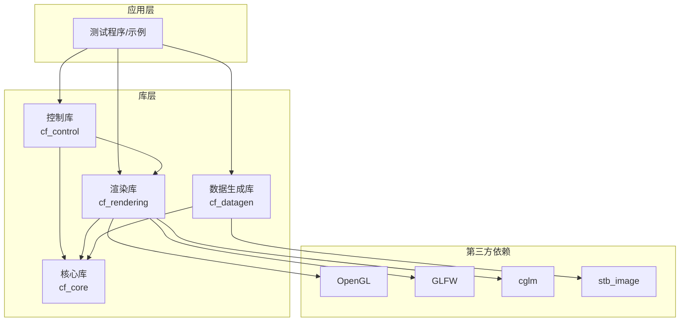
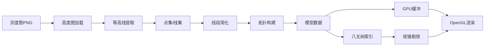

# Contourforge 架构设计文档

**版本**: 1.0.0  
**日期**: 2026-04-30  
**作者**: Contourforge Architecture Team

---

## 目录

1. [项目概述](#1-项目概述)
2. [技术栈](#2-技术栈)
3. [系统架构](#3-系统架构)
4. [核心模块设计](#4-核心模块设计)
5. [数据结构](#5-数据结构)
6. [API接口](#6-api接口)
7. [性能优化](#7-性能优化)
8. [构建系统](#8-构建系统)
9. [开发路线图](#9-开发路线图)

---

## 1. 项目概述

### 1.1 项目简介

**Contourforge** 是一个开源的高性能3D地理等高线渲染库，使用C语言开发，专为处理千万级节点的大规模地形数据而设计。

### 1.2 核心特性

- ✅ **高性能渲染**: 支持千万级节点实时渲染（60 FPS）
- ✅ **模块化设计**: 独立的渲染、数据生成、交互控制库
- ✅ **跨平台**: Windows、Linux、macOS全支持
- ✅ **易于集成**: 简洁的C语言API
- ✅ **开源友好**: MIT许可证

### 1.3 应用场景

- 地理信息系统（GIS）
- 地形可视化
- 科学数据可视化
- 游戏地形编辑器
- 建筑规划工具

### 1.4 性能目标

| 指标 | 目标值 |
|------|--------|
| 节点规模 | 1000万+ |
| 帧率 | 60 FPS |
| 内存占用 | <4GB @ 1000万节点 |
| 加载时间 | <5秒 @ 1000万节点 |

---

## 2. 技术栈

### 2.1 核心技术

| 组件 | 技术选型 | 理由 |
|------|----------|------|
| **编程语言** | C11 | 高性能、跨平台、底层控制 |
| **图形API** | OpenGL 3.3 Core | 成熟稳定、跨平台、性能充足 |
| **窗口管理** | GLFW 3.x | 轻量级、专为OpenGL设计 |
| **数学库** | cglm | 高性能、SIMD优化 |
| **图像加载** | stb_image.h | 单头文件、易集成 |
| **构建系统** | CMake 3.15+ | 跨平台、现代化 |
| **测试框架** | Unity Test | 专为C设计、轻量级 |

### 2.2 技术选型对比

详见 [`plans/02-technology-stack.md`](plans/02-technology-stack.md)

**为什么选择OpenGL而非Vulkan？**
- OpenGL开发效率高5-10倍
- 对于等高线渲染，性能完全够用
- 跨平台支持更成熟
- 社区资源丰富

---

## 3. 系统架构

### 3.1 整体架构图



### 3.2 模块职责

#### 核心库（cf_core）
- 内存管理（内存池、对象池）
- 基础数据结构（点集、线集、面集）
- 空间索引（八叉树）
- 文件I/O

#### 渲染库（cf_rendering）
- OpenGL渲染管线
- 相机系统
- 着色器管理
- GPU缓冲管理
- 视锥剔除

#### 数据生成库（cf_datagen）
- 高度图加载
- 等高线提取（Marching Squares）
- 线段简化（Douglas-Peucker）
- 拓扑构建

#### 控制库（cf_control）
- 输入处理
- 节点选择（射线投射）
- 交互编辑
- 撤销/重做

### 3.3 数据流



---

## 4. 核心模块设计

### 4.1 目录结构

```
Contourforge/
├── include/contourforge/      # 公共API头文件
│   ├── cf_core.h
│   ├── cf_rendering.h
│   ├── cf_datagen.h
│   ├── cf_control.h
│   └── cf_math.h
├── src/
│   ├── core/                  # 核心模块实现
│   ├── rendering/             # 渲染模块实现
│   ├── datagen/               # 数据生成实现
│   └── control/               # 控制模块实现
├── shaders/                   # GLSL着色器
├── tests/                     # 单元测试
├── examples/                  # 示例程序
├── third_party/               # 第三方依赖
└── docs/                      # 文档
```

完整目录结构详见 [`plans/03-data-structures.md`](plans/03-data-structures.md)

### 4.2 模块依赖关系

```
cf_control → cf_rendering → cf_core
           ↘              ↗
            cf_datagen →
```

**依赖规则**:
- 核心库（cf_core）不依赖任何其他库
- 其他库可以依赖核心库
- 避免循环依赖

---

## 5. 数据结构

### 5.1 基础类型

```c
// 3D点
typedef struct {
    float x, y, z;
} cf_point3_t;

// 索引类型（支持大规模数据）
typedef uint32_t cf_index_t;

// 返回码
typedef enum {
    CF_SUCCESS = 0,
    CF_ERROR_INVALID_PARAM = -1,
    CF_ERROR_OUT_OF_MEMORY = -2,
    // ...
} cf_result_t;
```

### 5.2 核心数据结构

#### 点集（Point Set）
```c
typedef struct {
    cf_point3_t* points;        // 点数组
    size_t count;               // 点数量
    size_t capacity;            // 容量
    cf_bounds_t bounds;         // 边界盒
    bool dirty;                 // 是否需要更新GPU缓冲
} cf_point_set_t;
```

#### 线集（Line Set）
```c
typedef struct {
    cf_index_t p1;              // 起点索引
    cf_index_t p2;              // 终点索引
} cf_line_t;

typedef struct {
    cf_line_t* lines;           // 线段数组
    size_t count;               // 线段数量
    cf_point_set_t* point_set;  // 关联的点集
} cf_line_set_t;
```

#### 面集（Face Set）
```c
typedef struct {
    cf_index_t l1, l2, l3;      // 三条线段索引
} cf_face_t;

typedef struct {
    cf_face_t* faces;           // 面数组
    size_t count;               // 面数量
    cf_line_set_t* line_set;    // 关联的线集
} cf_face_set_t;
```

#### 模型（Model）
```c
typedef struct {
    cf_point_set_t* points;     // 点集
    cf_line_set_t* lines;       // 线集
    cf_face_set_t* faces;       // 面集（可选）
    cf_bounds_t bounds;         // 整体边界盒
    char* name;                 // 模型名称
} cf_model_t;
```

### 5.3 八叉树

```c
typedef struct cf_octree_node {
    cf_bounds_t bounds;                 // 节点边界
    cf_index_t* point_indices;          // 点索引数组
    size_t point_count;                 // 点数量
    struct cf_octree_node* children[8]; // 8个子节点
    bool is_leaf;                       // 是否叶节点
} cf_octree_node_t;
```

完整数据结构详见 [`plans/03-data-structures.md`](plans/03-data-structures.md)

### 5.4 内存布局

**千万级节点内存估算**:
- 点数据: 120 MB（10M × 12 bytes）
- 线数据: 160 MB（20M × 8 bytes）
- 面数据: 120 MB（10M × 12 bytes）
- 八叉树: 40 MB
- GPU缓冲: 600 MB
- **总计**: ~1040 MB (~1 GB)

**优化后**: ~300-400 MB（使用压缩和LOD）

---

## 6. API接口

### 6.1 API设计原则

- **命名约定**: `cf_<module>_<action>`
- **错误处理**: 返回 `cf_result_t` 错误码
- **内存管理**: 创建/销毁成对出现
- **线程安全**: 默认不保证，提供线程安全版本

### 6.2 渲染库API示例

```c
// 初始化渲染器
cf_result_t cf_renderer_init(
    int width, 
    int height, 
    const char* title,
    cf_renderer_t** renderer
);

// 设置模型
cf_result_t cf_renderer_set_model(
    cf_renderer_t* renderer,
    cf_model_t* model
);

// 渲染
cf_result_t cf_renderer_render(cf_renderer_t* renderer);

// 销毁
void cf_renderer_destroy(cf_renderer_t* renderer);
```

### 6.3 数据生成API示例

```c
// 加载高度图
cf_result_t cf_heightmap_load(
    const char* filepath,
    cf_heightmap_t** heightmap
);

// 生成等高线
cf_result_t cf_contour_generate(
    const cf_heightmap_t* heightmap,
    const cf_contour_config_t* config,
    cf_model_t** model
);

// 简化线段
cf_result_t cf_simplify_douglas_peucker(
    const cf_point3_t* points,
    size_t count,
    float tolerance,
    cf_point3_t** out_points,
    size_t* out_count
);
```

### 6.4 控制库API示例

```c
// 创建选择器
cf_result_t cf_selector_create(
    cf_model_t* model,
    cf_renderer_t* renderer,
    cf_selector_t** selector
);

// 选择节点
cf_result_t cf_selector_pick_point(
    cf_selector_t* selector,
    double screen_x,
    double screen_y,
    float radius,
    cf_index_t* out_index
);

// 移动节点
cf_result_t cf_editor_move_point(
    cf_editor_t* editor,
    cf_index_t point_index,
    cf_point3_t new_position
);
```

完整API文档详见 [`plans/04-api-design.md`](plans/04-api-design.md)

---

## 7. 性能优化

### 7.1 渲染优化

#### 批量渲染
```c
// 一次Draw Call渲染所有线段
glDrawArrays(GL_LINES, 0, line_count * 2);
```

#### 视锥剔除
- 使用八叉树快速查询可见节点
- 减少70-90%的渲染量

#### LOD（层次细节）
- LOD 0: 100%细节
- LOD 1: 50%细节
- LOD 2: 25%细节
- LOD 3: 10%细节

### 7.2 内存优化

#### 内存池
```c
typedef struct {
    void* memory;
    size_t block_size;
    size_t block_count;
    uint64_t* free_bitmap;
} cf_memory_pool_t;
```

**优势**:
- 消除malloc/free开销
- 减少内存碎片
- 提高缓存局部性

#### 数据压缩
- 点数据: 12 bytes → 6 bytes（50%压缩率）
- 使用int16量化float32

### 7.3 CPU优化

#### SIMD优化
```c
// AVX - 8个float并行运算
__m256 va = _mm256_load_ps(a);
__m256 vb = _mm256_load_ps(b);
__m256 vout = _mm256_add_ps(va, vb);
```

**性能提升**: 4-8倍

#### 多线程并行
- 等高线提取（按行并行）
- 线段简化（按段并行）
- 八叉树构建（按子树并行）

### 7.4 空间数据结构

#### 八叉树
- 快速空间查询 O(log n)
- 支持视锥剔除
- 支持LOD管理

#### 空间哈希
- O(1) 插入和查询
- 适合动态场景

完整优化策略详见 [`plans/05-performance-optimization.md`](plans/05-performance-optimization.md)

---

## 8. 构建系统

### 8.1 CMake配置

```cmake
cmake_minimum_required(VERSION 3.15)
project(Contourforge VERSION 1.0.0 LANGUAGES C)

# C11标准
set(CMAKE_C_STANDARD 11)
set(CMAKE_C_STANDARD_REQUIRED ON)

# 构建选项
option(CF_BUILD_SHARED "Build shared libraries" ON)
option(CF_BUILD_TESTS "Build tests" ON)
option(CF_BUILD_EXAMPLES "Build examples" ON)
option(CF_ENABLE_SIMD "Enable SIMD optimizations" ON)
```

### 8.2 编译命令

#### Windows
```bash
mkdir build && cd build
cmake .. -G "Visual Studio 17 2022" -A x64
cmake --build . --config Release
```

#### Linux/macOS
```bash
mkdir build && cd build
cmake .. -DCMAKE_BUILD_TYPE=Release
make -j$(nproc)
```

### 8.3 外部项目使用

```cmake
find_package(Contourforge REQUIRED)

add_executable(my_app main.c)
target_link_libraries(my_app
    Contourforge::cf_core
    Contourforge::cf_rendering
)
```

完整构建系统详见 [`plans/06-build-system.md`](plans/06-build-system.md)

---

## 9. 开发路线图

### Phase 1: 基础设施（2-3周）
- [x] 项目结构搭建
- [x] CMake配置
- [x] 依赖集成
- [ ] 基础数据结构实现
- [ ] 内存管理实现

### Phase 2: 渲染库（3-4周）
- [ ] OpenGL初始化
- [ ] 基础渲染管线
- [ ] 相机系统
- [ ] 着色器管理
- [ ] GPU缓冲管理

### Phase 3: 数据生成库（2-3周）
- [ ] 图像加载（stb_image）
- [ ] 等高线提取（Marching Squares）
- [ ] 线段简化（Douglas-Peucker）
- [ ] 拓扑构建
- [ ] 数据导出

### Phase 4: 控制库（2-3周）
- [ ] 输入处理（GLFW）
- [ ] 节点选择（射线投射）
- [ ] 交互编辑
- [ ] 撤销/重做
- [ ] 实时更新

### Phase 5: 优化和测试（2-3周）
- [ ] 八叉树实现
- [ ] 视锥剔除
- [ ] LOD系统
- [ ] 单元测试
- [ ] 性能测试
- [ ] 内存优化

### Phase 6: 文档和发布（1-2周）
- [ ] API文档（Doxygen）
- [ ] 用户指南
- [ ] 示例程序
- [ ] CI/CD配置
- [ ] 首次发布

**总计**: 12-18周（约3-4.5个月）

---

## 10. 文件格式规范

### 10.1 二进制格式（.cfm）

```
Offset | Size | Field
-------|------|------------------
0      | 4    | Magic: "CFM\0"
4      | 4    | Version (uint32)
8      | 8    | Point Count (uint64)
16     | 8    | Line Count (uint64)
24     | 8    | Face Count (uint64)
32     | 4    | Flags (uint32)
36     | 24   | Bounds (6 floats)
60     | 4    | Reserved
-------|------|------------------
64     | ...  | Point Data
       | ...  | Line Data
       | ...  | Face Data
```

### 10.2 JSON元数据（.cfm.json）

```json
{
  "version": "1.0.0",
  "source": {
    "type": "heightmap",
    "file": "terrain.png"
  },
  "bounds": {
    "min": [0.0, 0.0, 0.0],
    "max": [1000.0, 1000.0, 500.0]
  },
  "statistics": {
    "point_count": 10000000,
    "line_count": 20000000
  }
}
```

---

## 11. 测试策略

### 11.1 单元测试

- 内存管理测试
- 数据结构测试
- 算法正确性测试
- API接口测试

### 11.2 性能测试

| 场景 | 节点数 | 目标FPS |
|------|--------|---------|
| 小型 | 10万 | 60 |
| 中型 | 100万 | 60 |
| 大型 | 1000万 | 60 |
| 超大型 | 5000万 | 30 |

### 11.3 集成测试

- 完整工作流测试
- 跨平台测试
- 内存泄漏检测

---

## 12. 贡献指南

### 12.1 代码规范

- 使用C11标准
- 遵循项目命名约定
- 添加必要的注释
- 编写单元测试

### 12.2 提交流程

1. Fork项目
2. 创建功能分支
3. 提交代码
4. 运行测试
5. 创建Pull Request

---

## 13. 许可证

**MIT License** - 商业友好的开源许可证

---

## 14. 参考资料

### 14.1 技术文档

- [OpenGL 3.3 Core Profile](https://www.opengl.org/sdk/docs/man3/)
- [GLFW Documentation](https://www.glfw.org/documentation.html)
- [cglm Documentation](https://cglm.readthedocs.io/)

### 14.2 算法参考

- Marching Squares算法
- Douglas-Peucker线段简化
- 八叉树空间索引

### 14.3 相关项目

- [GDAL](https://gdal.org/) - 地理数据抽象库
- [CGAL](https://www.cgal.org/) - 计算几何算法库
- [libigl](https://libigl.github.io/) - 几何处理库

---

## 附录

### A. 详细设计文档

- [`plans/01-requirements-analysis.md`](plans/01-requirements-analysis.md) - 需求分析
- [`plans/02-technology-stack.md`](plans/02-technology-stack.md) - 技术选型
- [`plans/03-data-structures.md`](plans/03-data-structures.md) - 数据结构设计
- [`plans/04-api-design.md`](plans/04-api-design.md) - API接口设计
- [`plans/05-performance-optimization.md`](plans/05-performance-optimization.md) - 性能优化
- [`plans/06-build-system.md`](plans/06-build-system.md) - 构建系统

### B. 联系方式

- **项目主页**: https://github.com/username/contourforge
- **问题反馈**: https://github.com/username/contourforge/issues
- **邮件**: contourforge@example.com

---

**文档版本**: 1.0.0  
**最后更新**: 2026-04-30
