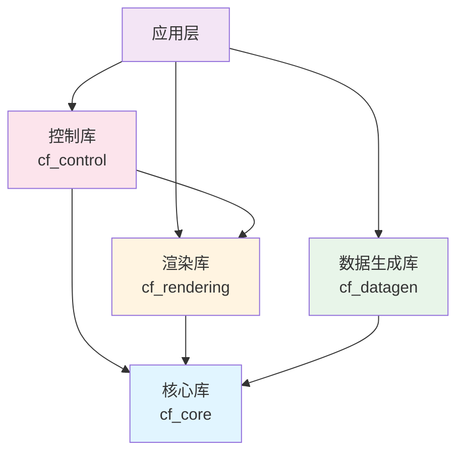
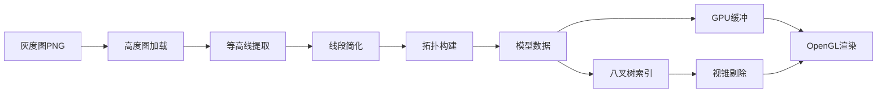

# Contourforge

<div align="center">

**高性能3D地理等高线渲染库**

[](https://www.gnu.org/licenses/agpl-3.0)
[](https://en.wikipedia.org/wiki/C11_(C_standard_revision))
[](https://www.opengl.org/)
[](https://github.com/czxieddan/contourforge)
[](https://github.com/czxieddan/contourforge)

[English](#) | [简体中文](#)

</div>

---

## 简介

Contourforge是一个开源的高性能3D地理等高线渲染库，使用C语言开发，专为处理千万级节点的大规模地形数据而设计。它提供了从高度图加载、等高线提取、线段简化到实时渲染和交互编辑的完整工作流。

### 核心特性

- **高性能渲染**: 支持千万级节点实时渲染（目标60 FPS）
- **模块化设计**: 独立的核心、渲染、数据生成、交互控制库
- **跨平台支持**: Windows、Linux、macOS全平台兼容
- **易于集成**: 简洁的C语言API，清晰的文档
- **完整工作流**: 从灰度图到3D模型的一站式解决方案
- **灵活配置**: 支持多种等高线生成和简化算法
- **实时编辑**: 支持节点选择、移动、插入和删除
- **空间索引**: 八叉树加速空间查询和视锥剔除
- **内存优化**: 内存池管理，减少碎片和分配开销

### 应用场景

- 地理信息系统（GIS）可视化
- 地形数据分析和处理
- 科学数据可视化
- 游戏地形编辑器
- 建筑规划和城市设计工具
- 教育和研究项目

---

## 快速开始

### 前置要求

- **编译器**: MSVC 2019+, GCC 7+, 或 Clang 6+（支持C11标准）
- **CMake**: 3.15或更高版本
- **OpenGL**: 3.3或更高版本
- **Git**: 用于克隆仓库和子模块

### 安装

#### Windows

```bash
git clone --recursive https://github.com/czxieddan/contourforge.git
cd contourforge
mkdir build && cd build
cmake .. -G "Visual Studio 17 2022" -A x64
cmake --build . --config Release
.\bin\Release\simple_viewer.exe
```

#### Linux

```bash
sudo apt install build-essential cmake libgl1-mesa-dev
git clone --recursive https://github.com/czxieddan/contourforge.git
cd contourforge
mkdir build && cd build
cmake .. -DCMAKE_BUILD_TYPE=Release
make -j$(nproc)
./bin/simple_viewer
```

#### macOS

```bash
brew install cmake
git clone --recursive https://github.com/czxieddan/contourforge.git
cd contourforge
mkdir build && cd build
cmake .. -DCMAKE_BUILD_TYPE=Release
make -j$(sysctl -n hw.ncpu)
./bin/simple_viewer
```

---

## 使用示例

### 基础渲染

从高度图生成等高线并渲染：

```c
#include <contourforge/contourforge.h>

int main() {
    // 加载高度图
    cf_heightmap_t* heightmap;
    cf_heightmap_load("data/heightmaps/terrain.png", &heightmap);
    
    // 配置等高线生成参数
    cf_contour_config_t config = {
        .interval = 10.0f,
        .min_height = 0.0f,
        .max_height = 1000.0f,
        .simplify_tolerance = 0.5f,
        .build_topology = true
    };
    
    // 生成等高线模型
    cf_model_t* model;
    cf_contour_generate(heightmap, &config, &model);
    
    // 初始化渲染器
    cf_renderer_config_t renderer_config = {
        .width = 1280,
        .height = 720,
        .title = "Contourforge Viewer",
        .vsync = true,
        .msaa_samples = 4,
        .clear_color = {0.1f, 0.1f, 0.1f, 1.0f}
    };
    cf_renderer_t* renderer;
    cf_renderer_init(&renderer_config, &renderer);
    cf_renderer_set_model(renderer, model);
    
    // 渲染循环
    while (!cf_renderer_should_close(renderer)) {
        cf_renderer_begin_frame(renderer);
        cf_renderer_render(renderer);
        cf_renderer_end_frame(renderer);
    }
    
    // 清理资源
    cf_renderer_destroy(renderer);
    cf_model_destroy(model);
    cf_heightmap_destroy(heightmap);
    
    return 0;
}
```

### 交互编辑

支持节点选择和编辑：

```c
// 创建编辑器和选择器
cf_editor_t* editor;
cf_editor_create(model, 100, &editor);

cf_selector_t* selector;
cf_selector_create(model, renderer, &selector);

// 选择节点
cf_index_t selected_point;
if (cf_selector_pick_point(selector, mouse_x, mouse_y, 5.0f, &selected_point) == CF_SUCCESS) {
    // 移动节点
    cf_point3_t new_pos = {x, y, z};
    cf_editor_move_point(editor, selected_point, new_pos);
}

// 撤销/重做
if (cf_editor_can_undo(editor)) {
    cf_editor_undo(editor);
}
```

更多示例请查看 [`examples/`](examples/) 目录。

---

## 项目结构

```
Contourforge/
├── include/contourforge/      # 公共API头文件
├── src/                       # 源代码实现
│   ├── core/                  # 核心模块（内存、数据结构、八叉树）
│   ├── rendering/             # 渲染模块（OpenGL、相机、着色器）
│   ├── datagen/               # 数据生成（高度图、等高线、简化）
│   └── control/               # 控制模块（输入、选择、编辑）
├── shaders/                   # GLSL着色器
├── tests/                     # 单元测试
├── examples/                  # 示例程序
├── data/                      # 测试数据
├── third_party/               # 第三方依赖
└── docs/                      # 文档
```

---

## 架构设计

### 模块依赖关系



### 数据处理流程



### 核心技术栈

| 组件 | 技术 | 版本 |
|------|------|------|
| 编程语言 | C | C11 |
| 图形API | OpenGL | 3.3 Core |
| 窗口管理 | GLFW | 3.3+ |
| 数学库 | cglm | 0.8.0+ |
| 图像加载 | stb_image | 单头文件 |
| OpenGL加载 | glad | 3.3 Core |
| 构建系统 | CMake | 3.15+ |

详细架构设计请查看 [`ARCHITECTURE.md`](ARCHITECTURE.md)

---

## 性能指标

以下为设计目标，实际性能取决于硬件配置和数据特征：

| 指标 | 目标值 | 说明 |
|------|--------|------|
| 节点规模 | 1000万+ | 设计容量 |
| 帧率 | 60 FPS | 1000万节点目标帧率 |
| 内存占用 | <4GB | 1000万节点预期内存 |
| 加载时间 | <5秒 | 1000万节点预期加载时间 |

详细性能测试报告请查看 [`docs/PERFORMANCE.md`](docs/PERFORMANCE.md)

---

## 测试

```bash
cd build
ctest                    # 运行所有测试
ctest -R test_memory     # 运行特定测试
ctest -V                 # 详细输出
```

---

## 文档

### 用户文档

- [快速开始](docs/USER_GUIDE.md#快速开始) - 5分钟上手指南
- [用户指南](docs/USER_GUIDE.md) - 完整使用教程
- [API参考](docs/API.md) - 详细的API文档
- [构建指南](BUILD.md) - 编译和安装说明

### 开发者文档

- [架构设计](ARCHITECTURE.md) - 系统架构和设计决策
- [开发者指南](docs/DEVELOPER_GUIDE.md) - 如何参与开发
- [贡献指南](CONTRIBUTING.md) - 代码规范和提交流程
- [性能优化](docs/PERFORMANCE.md) - 性能分析和优化技巧
- [变更日志](CHANGELOG.md) - 版本历史

---

## 贡献

欢迎贡献代码、报告问题或提出建议。

### 如何贡献

1. Fork本仓库
2. 创建功能分支 (`git checkout -b feature/AmazingFeature`)
3. 提交更改 (`git commit -m 'Add some AmazingFeature'`)
4. 推送到分支 (`git push origin feature/AmazingFeature`)
5. 创建Pull Request

### 代码规范

- 遵循C11标准
- 使用项目命名约定（`cf_<module>_<action>`）
- 添加必要的注释和文档
- 编写单元测试
- 确保所有测试通过

详细贡献指南请查看 [`CONTRIBUTING.md`](CONTRIBUTING.md)

---

## 许可证

本项目采用 **GNU Affero General Public License v3.0 (AGPL-3.0)** 许可证。

这意味着：
- 您可以自由使用、修改和分发本软件
- 您可以将本软件用于商业目的
- 如果您修改了本软件并通过网络提供服务，您必须公开修改后的源代码
- 任何基于本软件的衍生作品也必须使用AGPL-3.0许可证

详细许可证条款请参见 [LICENSE](LICENSE) 文件。

**第三方依赖许可证**：
- GLFW: zlib/libpng License
- glad: MIT/Public Domain
- cglm: MIT
- stb_image: MIT/Public Domain

详见 [`third_party/README.md`](third_party/README.md)

---

## 致谢

感谢以下开源项目：

- [GLFW](https://www.glfw.org/) - 窗口和输入管理库
- [cglm](https://github.com/recp/cglm) - 高性能C语言数学库
- [stb](https://github.com/nothings/stb) - 单头文件库集合
- [glad](https://glad.dav1d.de/) - OpenGL加载器生成器

---

## 联系方式

- 项目主页: https://github.com/czxieddan/contourforge
- 问题反馈: https://github.com/czxieddan/contourforge/issues
- 功能建议: https://github.com/czxieddan/contourforge/discussions

---

<div align="center">

Made with ❤️ by Contourforge Team

[回到顶部](#contourforge)

</div>
